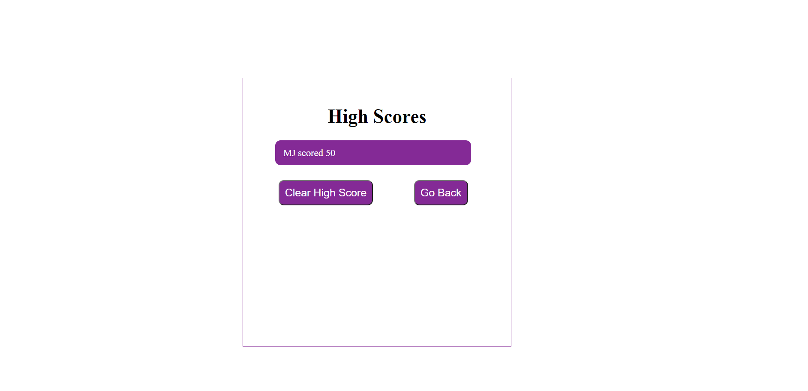

# Welcome to my Coding Quiz using JavaScript for Challenge 4!

### This challenge entails creating a timed quiz using HTML, CSS, and JavaScript. 

### The user reads the instructions and hits the Start Quiz button to begin. Once the quiz is started, the user is presented with a question and multiple choice answers.

 ### When the user hovers over the possible answers, the button will turn color to warn them of their choice.
 

### After the user answers the question, they are informed if the answer was correct or not.

### At the end of the quiz, the user is asked to submit their initials to be added to the high scores page.

### The user's initials are displayed onto the high scores page that can be accessed at any time by clicking the View High Scores link in the top left of the screen.

### Click here to take the Coding Quiz now!  https://jamwil1226.github.io/javascript-quiz/

### Thank you for visiting my Coding Quiz! All feedback is welcome!

### I look forward to hearing from you!

### _Jamie Williams_ 

